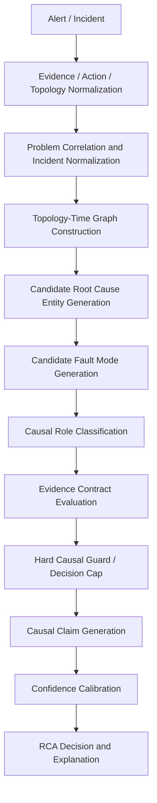

# RCA Causal Model

**版本：** V.2-RCA Causal Model Overview  
**状态：** 设计文档，非实现完成报告  
**最后更新：** 2026-05-12

> 后续设计补充：  
> - [RCA Causal Reasoning V2 Design](./rca-causal-reasoning-v2-design.md)  
> - [RCA Causal Reasoning V2 Scenario Derivations](./rca-causal-reasoning-v2-scenarios.md)
> - [RCA Causal Algorithm V2](./rca-causal-algorithm-v2.md)
> - [RCA Causal Design Review](./rca-causal-design-review.md)
> - [RCA Product Output Contract](./rca-product-output-contract.md)
> - [RCA Golden Fixture Contract](./rca-golden-fixture-contract.md)
> - [RCA Interaction PRD](../prd/rca_interaction_prd.md)
> - [RCA Interaction Prototype HTML](../prd/rca_interaction_prototype.html)

## 摘要

SRE Production Agent 的 RCA 模型不是简单的 pattern matching，也不应该由一个手工调权重的 `ConfidenceScorer` 直接裁决根因。V2 的目标模型是以 **Problem Window** 为时间边界，以 **Topology Graph** 为上下文，以 **Candidate Root Cause Entity** 为推理对象，把 telemetry / events / actions / topology 统一成可验证的因果声明，再用硬性因果规则限制结论上限。

新的总原则是：

```text
hard causal guards first
numeric confidence second
LLM/RAG/GraphRAG may propose and enrich
deterministic causal engine validates and decides
```

因此，`ConfidenceScorer` 的长期定位应从“根因裁判”降级为 `ConfidenceCalibrator`：它只在 evidence contract、causal guard、provider trust 已经给出结论上限之后，负责排序、归一化和解释置信度。

当前系统已完成从 pattern-first 到 topology-first 的第一步重构（Provider Alias 分离、证据类型归一化、Score Breakdown 可观测）。**Problem Window & Temporal Alignment 已于 V.2-RCA-1A.3 落地**；V.2-RCA-1A.4 的 Topology Graph 已进入部分实现阶段，包含轻量级 `ServiceTopology`、`TopologyEdge`、`PropagationPath`、配置拓扑加载和 bounded `topologyCausalityScore`。但新的 V2 总纲将后续方向从“继续给 ConfidenceScorer 加权重”调整为“先实现 evidence contract / causal guard / causal claim / verification fixtures”。

## 文档职责

| 文档 | 职责 |
|---|---|
| 本文档 | RCA 因果模型总纲：说明方向、核心概念、当前实现差距、演进路线。 |
| [RCA Causal Reasoning V2 Design](./rca-causal-reasoning-v2-design.md) | 定义领域模型：Entity、ObservationEvent、ActionEvent、TopologyEdge、CausalClaim、EvidenceTrust、EvidenceContract。 |
| [RCA Causal Algorithm V2](./rca-causal-algorithm-v2.md) | 定义执行算法：candidate 生成、causal role 分类、hard guard、decision cap、confidence calibration、LLM/GraphRAG 边界、验证策略。 |
| [RCA Causal Reasoning V2 Scenario Derivations](./rca-causal-reasoning-v2-scenarios.md) | 定义场景推导和后续 golden fixtures：每个场景要断言 leading claim、decision cap、evidence roles、missing evidence、counter-signal、diagnostic quality。 |
| [RCA Causal Design Review](./rca-causal-design-review.md) | 从 SRE/RCA 产品视角评估四篇文档，给出产品契约、架构风险、实现路线和下一步优先级。 |
| [RCA Product Output Contract](./rca-product-output-contract.md) | 定义 `RcaResult`、`CausalClaim`、`diagnosticQuality`、next probes、mitigation 和报告/UI 输出契约。 |
| [RCA Golden Fixture Contract](./rca-golden-fixture-contract.md) | 定义 scenarios 如何转成可执行 golden fixtures，以及 P0 最小测试集。 |
| [RCA Interaction PRD](../prd/rca_interaction_prd.md) | 对照 Dynatrace / Datadog / BigPanda / Resolve AI 的产品形态，定义 RCA 交互模型和当前 UI 演进方向。 |
| [RCA Interaction Prototype HTML](../prd/rca_interaction_prototype.html) | 静态 HTML 原型，用于评审 incident feed、RCA 工作台、claim cards、timeline、AI assistant 等目标交互。 |

---

## 为什么 Pattern-first 不够

### 旧模型

```
Evidence → Pattern Match → Coverage Score → Comparator → Decision
```

### 主要问题

1. **先枚举故障类型，而不是先识别影响路径。** Pattern 是第一入口，系统从"可能存在哪些故障"出发，而非"哪些实体受到了影响，异常如何传播"。
2. **无法区分 root cause entity 和 impacted entity。** order-service 的 5xx 可能源于自身，也可能源于 payment-service 超时——旧模型无法表达这种关系。
3. **supporting evidence type 过多时会稀释关键证据。** 证据类型归一化前，分母随 provider alias 膨胀，真实信号被噪声淹没。
4. **provider alias 容易污染 scoring denominator。** `metric_*`、`log_*`、`trace_*` 三类 alias 映射到同一 core type 时被重复计数，这是 R1-R4 回归 bug 的根因。
5. **不容易表达"异常如何传播"。** 只能判断"有异常"，不能判断"异常的起点在哪里，如何影响下游/上游"。
6. **容易把 direct-only anomaly 误判为 root cause。** 一个服务自身有异常不代表它是根因——它可能是被上游影响。
7. **对 competing hypotheses 的解释不足。** 两个 hypothesis 分数接近时，旧模型只能说"分数接近"，无法解释是因为不同故障路径竞争、不同证据来源冲突，还是模型本身信息不足。

### Pattern 仍然是需要的

Pattern 不应被否定，而应**下沉到 fault mode evidence contract**。Pattern 描述的是"某种故障类型应该有哪些证据特征"，而不是"先猜故障类型再找证据"。

结论：

> Pattern 仍然需要，但位置要下沉到 fault mode evidence contract。  
> RCA 入口从 Pattern 上移到 Problem Window + Affected Entity + Topology。

---

## 新模型总览

### Target Pipeline

```
Alert / Incident
  → Evidence / Action / Topology Normalization
  → Problem Correlation and Incident Normalization
  → Topology-Time Graph Construction
  → Candidate Root Cause Entity Generation
  → Candidate Fault Mode Generation
  → Causal Role Classification
  → Evidence Contract Evaluation
  → Hard Causal Guard / Decision Cap
  → Causal Claim Generation
  → Confidence Calibration
  → RCA Decision and Explanation
```



### Pipeline 阶段说明

| 阶段 | 输入 | 输出 | 当前状态 |
|------|------|------|----------|
| Evidence / Action / Topology Normalization | Prometheus/Loki/Trace/K8s/Alertmanager/CI/CD/CloudTrail 等原始输入 | `ObservationEvent[]` / `ActionEvent[]` / `TopologyEdge[]` | **部分实现** — 已有 `Evidence`，但 Observation/Action/Topology 仍未完全分层 |
| Problem Correlation and Incident Normalization | alerts + normalized facts + topology | 一个可更新的 `Problem` / `IncidentFingerprint` | **部分实现** — 已有 sustained alert 和 topology fingerprint，缺完整 lifecycle |
| Topology-Time Graph | trace/config/k8s owner refs/cloud/service catalog | 带时间有效性的 topology subgraph | **部分实现** — `ServiceTopology` / `TopologyProvider` / `PropagationPath` 已有雏形 |
| Candidate Root Cause Entity | affected entities + graph + actions | 候选根因实体 | **设计阶段** — 当前仍偏 pattern-first |
| Candidate Fault Mode | candidate entity type + contracts | 候选 fault mode | **部分实现** — `DiagnosticPattern` 隐式承载 fault mode |
| Causal Role Classification | events + candidate + topology + time + trust | `PRIMARY` / `SYMPTOM` / `COUNTER` / `CONTROL_PLANE` 等角色 | **设计阶段** |
| Evidence Contract Evaluation | causal roles + fault mode contract | contract result / missing evidence / counter-signal | **设计阶段** |
| Hard Causal Guard / Decision Cap | contract result + provider trust | `allowedDecision` / `maxConfidence` | **设计阶段** |
| Causal Claim | candidate + relation + evidence | `CausalClaim` | **设计阶段** |
| Confidence Calibration | allowed claims + evidence strength + historical prior | calibrated confidence | **部分实现** — 当前 `ConfidenceScorer` 只是过渡实现 |
| RCA Decision and Explanation | ranked claims | final decision + explanation + next probes | **部分实现** — `HypothesisComparator` / report 已有，但未接入 decision cap |

---

## 核心概念定义

### Problem Window

Problem Window 是 RCA 的**时间边界**。由 alert `startsAt`、`lookbackWindow`、`lookaheadWindow` 或 incident window 共同确定。

**核心字段：**

```
problemStart    — 异常最早观测时间
problemEnd      — 异常结束或当前时间
lookbackWindow  — 向前追溯窗口（如 30min）
lookaheadWindow — 向前观测窗口（如 5min）
```

**作用：**

1. 判断 anomaly 是否相关（timestamp ∈ [problemStart - lookback, problemEnd + lookahead]）
2. 判断 candidate anomaly 是否早于 impacted anomaly（时序因果）
3. 判断 deploy/change event 是否在合理窗口内
4. 防止把无关时间段的 evidence 误纳入 RCA

**当前状态：** `ProblemWindow` 值对象已实现（`domain/ProblemWindow.java`）。通过 `deriveFromIncident()` 从 incident 推导窗口（默认 lookback=5min, lookahead=10min），支持 alert/evidence_fallback/unknown 三种来源。`TemporalAligner` 已接入过渡版 `ConfidenceScorer`。目标模型中，时间对齐应先作为 temporal guard 的输入，再作为 confidence calibration 的辅助维度。

---

### Entity

RCA 的推理对象是**实体**，而非证据类型。

**实体类型：**

```
service         — 微服务（order-service, payment-service）
endpoint        — API 端点（/checkout, /pay）
workload        — Kubernetes workload（Deployment, StatefulSet）
pod             — Kubernetes Pod
node            — Kubernetes Node
deployment      — Deployment 版本/变更
external dependency — 外部依赖（payment gateway, Redis）
```

**实体角色区分：**

```
affectedEntity            — 直接受影响的实体（alert 报告的对象）
candidateRootCauseEntity  — 可能为根因的实体（推理目标）
impactedEntity            — 被传播影响的实体（非根因，但是受害者）
supportingEntity          — 提供佐证证据的实体（如中间件、基础设施）
```

**当前状态：** `Evidence` 记录有 `service` 字段表示来源实体，但缺少 Entity 作为一级领域对象。`affectedEntity` 从 alert 中提取，`candidateRootCauseEntity` 尚未独立建模。

---

### Topology Graph

Topology Graph 描述实体间的**依赖关系**。RCA 使用拓扑图来判断异常是否沿依赖方向传播。

**来源（按优先级）：**

```
1. trace parent-child edge         — 最高优先级（实际调用链路）
2. observed service dependency     — Prometheus metric / 日志中的调用关系
3. configured demo topology        — 实验室环境预配置
4. static fallback topology        — 文档/CMDB 中的静态关系
5. Kubernetes owner reference      — Pod → Deployment → Namespace
```

**优先级：** `trace edge > observed dependency > configured topology > static fallback`

**边的属性：**

```
edgeType        — CALLS, DEPENDS_ON, HOSTED_BY
edgeSource      — trace, observed, configured, static
edgeConfidence  — high, medium, low
```

**当前状态：** 已有轻量级 `ServiceTopology` 数据结构、`TopologyProvider` 配置加载器和 `topology.yaml`，demo-services 拓扑可配置为 `order-service → payment-service / inventory-service`。`LiveEvidenceCollector` 已使用 topology 跳过叶子节点的 downstream 查询，`IncidentService` 已按 topology chain 聚合受影响服务证据，`IncidentDetector` 已用 topology fingerprint 做链路级去重。尚缺独立 `TopologyBuilder`，trace provider 产出的 span parent-child 关系还没有统一构建成 topology graph。

---

### Propagation Path

Propagation Path 描述异常如何沿依赖方向**影响其他实体**。

**示例：**

```
order-service → payment-service
```

解读：order-service 调用 payment-service；payment-service 变慢会向上游传播为 order-service 的 checkout latency / timeout。

**传播类型：**

```
downstream latency    → upstream latency / timeout
downstream error      → upstream error / retry
resource pressure     → service latency / error
deployment change     → service error / latency
crash loop            → service availability drop
```

**方向性：** 异常传播方向与调用方向相反。被调用方异常 → 调用方受影响。这是 RCA 推理的核心规则。

**当前状态：** 已有 `TopologyEdge` 作为单跳传播上下文，也已有 `PropagationPath` 表达多跳传播路径。`ServiceTopology` 支持 `findDependencyPath(caller, dependency)` 和 `findImpactPath(failedDependency, impactedCaller)` 两类路径查询；`ConfidenceResult` / Markdown report 会展示 propagation path。`ConfidenceScorer` 对 `downstream_dependency_latency` 这类依赖传播假设引入 bounded、path-length-aware 的 `topologyCausalityScore`。但系统仍缺少独立 `TopologyBuilder` 和显式 `propagationScore`；VerificationEngine 中的 contradiction rules 仍隐式承担部分传播语义。

---

### Candidate Root Cause Entity

RCA 首先应该生成 **candidate entity**，而不是直接生成 pattern。

**示例：**

```
payment-service
payment-service pod payment-7f8c9-abcde
order-service deployment v2.3.1
external payment gateway
```

每个 candidate entity 后续才会被分配 fault mode 和证据。

**当前状态：** 系统跳过这一步，直接从 pattern 生成 hypothesis。Hypothesis 中虽然隐含了候选实体（通过 evidence 的 service 字段），但未显式建模。

---

### Fault Mode

Fault Mode 描述故障的**语义类型**。每个 fault mode 对应一组 evidence contract（见 4.8 节）。

**支持的 Fault Mode：**

```
LATENCY_DEGRADATION     — 延迟升高
ERROR_SPIKE             — 错误率突增
TIMEOUT                 — 超时
RESOURCE_PRESSURE       — 资源压力（CPU/内存）
CRASH_LOOP              — Pod 崩溃循环
DEPLOYMENT_REGRESSION   — 部署引入的回归
CONFIGURATION_ERROR     — 配置错误
NETWORK_ERROR           — 网络错误
UNKNOWN                 — 未知故障类型
```

**当前状态：** DiagnosticPattern 的 id 携带 fault mode 语义（如 `deployment_regression`、`pod_crash_loop`），但无独立的 FaultMode 枚举或分类器。

---

### Evidence

Evidence 不是单纯字符串，而是结构化记录。

**核心字段（当前实现）：**

```
id            — 唯一标识
incidentId    — 所属 incident
source        — 数据来源（prometheus, loki, kubernetes, alertmanager, trace）
evidenceType  — 证据类型（如 error_rate_spike_after_deploy）
service       — 来源实体
timestamp     — 采集时间
content       — 可读描述
attributes    — 结构化属性
strength      — 信号强度 0.0-1.0
```

**证据分类：**

```
core evidence type     — 主干证据类型（如 error_rate_spike_after_deploy）
provider alias         — 提供商标识前缀（metric_*, log_*, trace_*），归一化到 core type
metadata               — attributes 中的键值对
no_signal              — 查询无结果（如 metric_no_signal）
counter evidence       — 反驳当前假设的证据
corroborating evidence — 佐证证据（存在加分，不存在不扣分）
```

**关键设计原则：**

> provider alias 不应直接污染 scoring denominator；  
> 应先归一化到 core evidence type。

**当前状态：** 已完成 alias → core 归一化（`ConfidenceScorer.ALIAS_TO_CORE`），佐证证据（corroboratingEvidenceTypes）已支持。

---

## 时间模型：Temporal Alignment

故障发生时间决定 RCA 推理的因果方向。

### 关键时间戳

```
candidate anomaly firstSeen   — 候选根因实体的异常最早观测时间
impacted anomaly firstSeen    — 受影响实体的异常最早观测时间
change event timestamp        — 部署/配置变更时间
alert startsAt                — 告警触发时间
evidence timestamp            — 证据采集时间
```

### 时序规则

```
candidate anomaly BEFORE impacted anomaly  → 加分（支持因果关系）
candidate anomaly AFTER impacted anomaly   → 降分或排除（违反因果）
candidate 与 impacted 同时                → 中性或小幅加分
evidence outside problem window            → 不计或降权
deploy event BEFORE anomaly               → deployment_regression 佐证加分
deploy event AFTER anomaly                → 排除 deployment_regression
```

### 输出维度

```
temporalAlignmentScore  — 0.0-1.0，归一化到评分公式
```

**当前状态：** `TemporalAligner`（`verification/TemporalAligner.java`）已实现。通过区分 candidate entity 与 impacted entity 的 evidence 时间戳判断因果方向（candidate before impacted → +0.10, simultaneous → +0.05, reverse → -0.10），结合 evidence 在 Problem Window 内的覆盖率调整窗口分（+0.05 上限，-0.05 上限）。`TemporalAlignmentResult` 记录 score/confidence/explanation/firstSeen 时间戳/窗口覆盖率。缺失 timestamp 时降级为 `TemporalConfidence.UNKNOWN`，score=0，不影响现有 scoring。

---

## 拓扑模型：Topology Causality

Topology 回答："候选根因实体是否在受影响实体的依赖路径上？"

### 维度

```
edgeType        — 边类型（CALLS, DEPENDS_ON, HOSTED_BY）
edgeSource      — 边来源（trace, observed, configured, static）
edgeConfidence  — 边置信度
pathLength      — 路径长度（跳数）
pathConfidence  — 整条路径的置信度
direction       — 传播方向（UPSTREAM, DOWNSTREAM, SELF）
```

### edgeSource 权重

```
trace observed edge:         high confidence（实际调用链）
observed dependency:         medium-high（metrics/logs 中观测到的依赖）
configured topology:         medium（实验室预配置）
static fallback topology:    low（文档/CMDB 静态信息）
```

### 例外

```
CrashLoop 是 local fault，可以没有 upstream/downstream path。
此时 topologyCausalityScore 可以为 0 或使用 pod→node→cluster 的 host 拓扑。
```

**当前状态：** 拓扑模型已部分实现。`ServiceTopology` 表达 service dependency graph，`TopologyEdge` 表达单条 RCA 相关依赖边，`PropagationPath` 表达多跳依赖/影响路径，支持 `edgeSource`、`edgeConfidence`、`pathConfidence`、`direction`、`pathLength` 和解释文本。`ConfidenceScorer` 可从 trace / service_dependency_match / observed dependency evidence 解析 `TopologyEdge`，也可接收 `PropagationPath` 做 path-length-aware bounded scoring。尚未实现独立 `TopologyBuilder` 和 provider-derived topology 的统一合并。

---

## 传播模型：Impact Propagation

仅有 candidate 自身异常不一定足够。需要判断它是否**影响了** alert 对应的 affected entity。

### 传播类型

```
downstream latency     → upstream latency / timeout
downstream error       → upstream error / retry
resource pressure      → service latency / error
deployment change      → service error / latency
crash loop             → service availability drop
```

### 传播强度

```
propagationScore = f(
    candidate anomaly severity,
    topology path confidence,
    affected entity anomaly severity,
    temporal order (candidate before affected)
)
```

### 关键判断

> 仅有 candidate 自身异常不一定足够；  
> 要看它是否影响了 alert / incident 对应的 affected entity。

**当前状态：** 传播模型未实现。VerificationEngine 的 contradiction rules 隐式编码了传播语义。

---

## Fault Mode Evidence Contract

Pattern 不再是第一入口，而是 **fault mode evidence contract**。

每个 fault mode contract 定义：

```
directSignals              — 直接信号（该故障类型必然特征）
propagationSignals         — 传播信号（对上游/下游的影响）
supportingSources          — 支持性证据来源（metric, log, trace, k8s, alert）
counterSignals             — 反证信号（当这些信号更强时排除此 fault mode）
nonBlockingMissingSignals  — 非阻塞缺失信号（常见缺失但不否决）
explanationTemplate        — 解释模板
```

### LATENCY_DEGRADATION

```
directSignals:
  p95 latency high
  p99 latency high
  trace downstream span slow
  slow request logs

propagationSignals:
  upstream latency high
  parent span slow
  client timeout

counterSignals:
  crash loop dominates
  deployment regression dominates
  resource pressure dominates
```

### ERROR_SPIKE

```
directSignals:
  5xx rate high
  exception logs
  failed request count high

propagationSignals:
  upstream failed calls
  retry storm
  error alert
```

### TIMEOUT

```
directSignals:
  timeout logs
  trace span timeout
  client timeout

propagationSignals:
  upstream request timeout
  gateway timeout
```

### RESOURCE_PRESSURE

```
directSignals:
  CPU high
  memory high
  throttling
  saturation

propagationSignals:
  latency increase
  error increase
```

### CRASH_LOOP

```
directSignals:
  restart count
  CrashLoopBackOff
  container terminated
  OOMKilled

topology:
  service-to-service path optional
```

### DEPLOYMENT_REGRESSION

```
directSignals:
  deploy event before anomaly
  post-deploy error / latency increase

counterSignals:
  stronger infra/runtime cause
```

---

## Causal Decision and Confidence Calibration

V2 不再把“统一加权公式”作为根因裁决的设计目标。新的目标是：

```text
causal guard decides what is allowed
confidence calibrator ranks allowed claims
```

也就是说，系统先回答：

```text
这个 hypothesis 在证据边界内最高能到什么 decision？
```

再回答：

```text
在允许范围内，它的置信度应该是多少？
```

### Hard Causal Guards

Hard guard 是因果边界，不是普通分数项。

| Guard | 作用 |
|---|---|
| Primary evidence guard | 某类故障必须具备能证明该故障的核心证据。 |
| Topology guard | 依赖传播类故障必须存在 topology path 或 observed dependency。 |
| Explicit action guard | deployment/config/flag/reboot 等回归类故障必须有显式动作。 |
| Temporal guard | 候选根因异常/动作必须早于或同窗于影响症状。 |
| Counter-signal guard | 健康信号、rollback 无效、候选正常等反证会降低或拒绝候选。 |
| Provider trust guard | 区分“没看到问题”和“看不到问题”。 |

### Decision Cap

Guard 的输出是 decision cap，而不是分数：

| Allowed decision | Max confidence | 语义 |
|---|---:|---|
| `NOT_ROOT_CAUSE` | 0.00 | 反证或边界条件排除候选。 |
| `UNCERTAIN_REQUIRES_MORE_EVIDENCE` | 0.49 | 候选可能相关，但缺少必要证据。 |
| `POSSIBLE_ROOT_CAUSE` | 0.69 | 有合理证据，但不足以强裁决。 |
| `PROBABLE_ROOT_CAUSE` | 0.84 | 主要证据、时间、拓扑大体成立。 |
| `LIKELY_ROOT_CAUSE` | 0.95 | 多源证据强一致，关键反证已排除。 |

示例：

```text
restart_count + pod_not_ready
  without crash reason / exit code / startup failure log
  => pod_crash_loop maxDecision = UNCERTAIN_REQUIRES_MORE_EVIDENCE

deployment action
  without change-specific runtime evidence
  => deployment_regression maxDecision = POSSIBLE_ROOT_CAUSE

downstream latency
  without topology path or observed dependency
  => downstream_dependency_latency maxDecision = UNCERTAIN_REQUIRES_MORE_EVIDENCE
```

### Confidence Calibration

只有通过 guard 的候选才进入 confidence calibration：

```text
contractResult = EvidenceContractEvaluator.evaluate(...)
allowedDecision = contractResult.allowedDecision

confidence = ConfidenceCalibrator.calibrate(
    primaryEvidenceStrength,
    secondaryEvidenceStrength,
    propagationStrength,
    temporalStrength,
    actionContextStrength,
    counterEvidenceStrength,
    providerTrust,
    historicalPrior
)

confidence = min(confidence, allowedDecision.maxConfidence)
```

### 关键原则

> 不按 evidence 数量刷分；  
> 不让经验权重越过 hard guard；  
> 宁可输出 uncertain + next probe，也不要给弱证据高置信根因。

### 当前实现

当前 `ConfidenceScorer` 是过渡实现，仍然以经验权重公式把 coverage、temporal、topology、counter evidence 合并为一个分数：

```java
rawScore = baseScore
    + weightedSupportingCoverage × 0.60     // 对应 faultModeEvidenceScore
    + weightedCorroboratingCoverage × 0.10  // 对应 multiSourceCorroborationScore（部分）
    + temporalAlignmentScore                // V.2-RCA-1A.3 bounded [-0.15, +0.15]
    + topologyCausalityScore                // V.2-RCA-1A.4 bounded [0.00, +0.10]
    - weightedCounterCoverage × 0.30        // 对应 counterEvidencePenalty
    - missingPenalty                        // 对应 entityAnomalyScore（反向）
    - contradictionPenalty                  // 对应 propagationScore（隐式）
```

**缺失维度：** `entityAnomalyScore`（正向）、`propagationScore`（显式、多跳）、`ambiguityPenalty`。`topologyCausalityScore` 当前只对依赖传播类假设提供小幅 bounded bonus，还不是完整 topology-aware causal scoring。

更重要的是，它缺少 hard guard / decision cap，所以仍可能被弱症状、证据数量、provider blind spot 影响。目标定位是逐步收敛为 `ConfidenceCalibrator`：

1. 输入已经归类好的 `CausalRole`、`CausalClaim`、provider trust 和 evidence contract 结果。
2. 尊重 decision guard 产生的 `maxDecision` / `maxConfidence`。
3. 在允许的候选之间做稳定排序和置信度表达。
4. 不用经验权重把弱症状堆成高置信根因。

目标形态：

```text
contractResult = EvidenceContractEvaluator.evaluate(...)
allowedDecision = contractResult.allowedDecision
confidence = ConfidenceCalibrator.calibrate(contractResult, providerTrust, history)
confidence = min(confidence, allowedDecision.maxConfidence)
```

---

## Decision Rules

### 决策规则（目标模型）

```
guardResult = EvidenceContractEvaluator.evaluate(...)
allowedDecision = guardResult.allowedDecision

if allowedDecision == NOT_ROOT_CAUSE:
    → reject candidate

if allowedDecision == UNCERTAIN_REQUIRES_MORE_EVIDENCE:
    → produce missing evidence + next probes

if multiple candidates have compatible evidence and no decisive gap:
    → COMPETING_HYPOTHESES

else:
    → calibrate confidence within allowedDecision.maxConfidence
```

### 当前实现（HypothesisComparator）

| Decision | 条件 |
|----------|------|
| `likely_root_cause` | top1 ≥ 0.80 且 gap ≥ 0.15 |
| `probable_root_cause` | top1 ≥ 0.60 且 gap ≥ 0.10 |
| `competing_hypotheses` | top1 ≥ 0.40 且 top2 ≥ 0.40 且 gap < 0.10 |
| `uncertain_requires_more` | top1 ≥ 0.40 |
| `insufficient_evidence` | top1 < 0.40 |

**差异分析：** 当前规则仅依赖分数阈值，未纳入 primary evidence、explicit action、provider trust、topology guard、temporal guard 和 counter-signal guard。新目标不是继续微调 0.80/0.60/0.40 这类阈值，而是在分数之前先计算 `allowedDecision`。

新的 V2 目标不再是简单替换阈值，而是让 `HypothesisComparator` 接收 `allowedDecision` / `maxConfidence` / `CausalClaim`，避免纯分数越过因果边界。

### 关键设计原则

```
topology 是依赖传播类故障的重要条件；
local fault 可以不依赖 service-to-service topology。
```

---

## 各故障类型如何套用模型

| Fault Mode | Candidate Entity | Topology Required? | Key Direct Evidence | Key Propagation Evidence | Typical Counter Evidence |
|-----------|-----------------|-------------------|--------------------|------------------------|--------------------------|
| latency | downstream service | **Yes** | p95/p99 high, span slow | upstream timeout | resource pressure, deploy regression |
| error | downstream service | **Yes** | 5xx rate high, exception logs | upstream retry storm | crash loop, conf error |
| timeout | downstream/external dependency | **Yes** | timeout logs, span timeout | gateway timeout | network error |
| resource_pressure | pod/node | **No** (local) | CPU/memory high, throttling | latency/error increase | deployment regression |
| crash_loop | pod | **No** (local) | CrashLoopBackOff, OOMKilled | availability drop | deployment regression, conf error |
| deployment_regression | deployment/config/flag | **No** (explicit action required) | explicit action + post-action anomaly + change-specific runtime evidence | service error/latency after action | no action, anomaly predates action, rollback no improvement, stronger runtime cause |
| configuration_error | deployment/config | **No** (change event) | config change, error after change | service misbehavior | runtime resource issue |
| network_error | node/network | **No** (infra) | connection refused, DNS failure | service unreachable | application-level error |

---

## Decision Cap / Confidence 示例

### 示例 1：payment-service latency（理想场景）

```
affectedEntity: order-service
candidateRootCauseEntity: payment-service
propagationPath: order-service → payment-service
faultMode: LATENCY_DEGRADATION

guardResult:
  primaryEvidence: pass
  topologyPath: pass
  temporalOrder: pass
  counterSignal: none
  providerTrust: normal

allowedDecision: LIKELY_ROOT_CAUSE
maxConfidence: 0.95
calibratedConfidence: 0.88

claim:
  payment-service latency LIKELY_CAUSED order-service timeout
```

### 示例 2：deployment regression vs downstream latency 竞争

```
deployment_regression:
  allowedDecision: POSSIBLE_ROOT_CAUSE
  reason: explicit deploy action exists, but change-specific runtime evidence is weak

downstream_latency:
  allowedDecision: PROBABLE_ROOT_CAUSE
  reason: topology path + dependency latency evidence + impacted timeout

decision: COMPETING_HYPOTHESES
```

说明：

> 系统不应强行唯一根因；  
> 当 deploy event 与 downstream latency 同时存在且证据边界都没有完全排除对方时，应保留竞争假设；  
> deploy action 不能单独把 deployment_regression 推到 probable/likely。

### 示例 3：当前系统实际产出（Scenario E，2026-05-09 生产验证）

```
affectedEntity: order-service (from alert)
hypotheses:
  deployment_regression:          0.54
  downstream_dependency_latency:  0.61

leading: downstream_dependency_latency (0.61)
gap: 0.07
decision: competing_hypotheses
```

当前系统在无完整 topology/propagation/temporal guard 的情况下，通过 evidence type coverage 模型仍能给出合理的竞争假设判决。目标模型中，`downstream_dependency_latency` 应先通过 topology path、primary latency evidence、temporal order 和 counter-signal guard，再进入 confidence calibration；不应仅靠 evidence coverage 微弱领先。

---

## LLM 的位置：Online Investigator + Deterministic Decision Boundary + Offline Knowledge Evolution

本系统不会把 LLM 排除在 RCA 过程之外。LLM 很适合做 online investigator：规划调查路径、选择 probe、提出候选根因、解释证据、指出 missing evidence。但生产 RCA 的最终结论必须经过 evidence verification、evidence contract、causal guard、provider trust、hypothesis comparison 和 event trace 审计。因此，**LLM 是 investigator 和 hypothesis proposer，不是无约束的 judge**。

> `LLM participates in online investigation, but deterministic RCA engine owns final decision authority.`  
> LLM 负责提出和解释；RCA 引擎负责验证和裁决。  
> **LLM proposes. RCA Engine verifies and decides.**

系统架构分为三层：

```
┌──────────────────────────────────────────┐
│  Layer 1: LLM Online RCA Investigator    │
│  规划调查路径 / 选择 probe / 提出假设      │
│  解释证据 / 指出 missing evidence          │
│  → 输出：investigation_plan, hypothesis   │
├──────────────────────────────────────────┤
│  Layer 2: Deterministic RCA Decision      │
│  验证 evidence / causal guard / cap       │
│  生成 claim / 校准 confidence / decision  │
│  → 输出：claim, confidence, event trace   │
├──────────────────────────────────────────┤
│  Layer 3: LLM Offline Knowledge Evolution │
│  复盘 / Gap 分析 / candidate 生成         │
│  → 输出：CausalGapReport, candidate       │
│  → human review → regression test → ship  │
└──────────────────────────────────────────┘
```

---

### Layer 1: LLM Online RCA Investigator

LLM 可以参与在线调查过程，但**不直接拥有最终裁判权**。

**LLM 可以做（Online）：**

| 职责 | 产出物 |
|------|--------|
| 规划调查路径 | `investigation_plan` |
| 选择 probe | `recommended_probe` |
| 提出 hypothesis | `proposed_hypothesis` |
| 解释 evidence | `evidence_interpretation` |
| 指出 missing evidence | `missing_evidence` |
| 生成置信度理由 | `confidence_rationale` |
| 建议下一步查询（metrics / logs / traces / k8s / deploy events） | `next_probe_targets` |

**LLM 不能直接写入：**

```
final_decision
final_score
root_cause_entity
production_pattern_registry
```

---

### Layer 2: Deterministic RCA Decision Engine

最终 decision 由 deterministic RCA engine 负责，不依赖 LLM。

**职责：**

| 职责 | 说明 |
|------|------|
| 验证 evidence 是否真实存在 | VerificationEngine |
| 验证 evidence 是否在 problem window 内 | 时间边界校验 |
| 验证 topology path 是否存在 | 拓扑路径验证 |
| 评估 evidence contract | EvidenceContractEvaluator（目标模型） |
| 计算 decision cap | CausalGuardEngine（目标模型） |
| 校准 confidence | ConfidenceCalibrator（由当前 ConfidenceScorer 演进） |
| 比较 hypotheses | HypothesisComparator / CausalClaimRanker |
| 生成 final decision | InvestigationDecision |
| 记录 event trace | EventTraceStore 审计日志 |

**关键表述：**

> LLM proposes. RCA Engine verifies and decides.  
> LLM 提出假设、解释证据；RCA 引擎验证真伪、计算 decision cap、校准 confidence、做出裁决。

---

### Layer 3: LLM Offline Knowledge Evolution Assistant

LLM 用于复盘、知识候选生成和回归测试建议。

**职责：**

| 职责 | 说明 |
|------|------|
| RCA run 复盘 | 分析一次调查的质量 |
| CausalGapReport | 识别因果维度缺失 |
| scoring gap analysis | 评分与实际 root cause 的差距分析 |
| pattern / fault mode contract candidate | 生成新的故障模式候选 |
| evidence mapping candidate | 建议新的 evidence → fault mode 映射 |
| regression case generation | 建议新增回归场景 |
| postmortem summarization | 生成事后总结 |
| diagnostic knowledge evolution | 知识库持续进化 |

**安全边界：**

> offline candidate 需要 human review、regression test、versioned release 后才能进入 production。  
> 不自动发布 pattern / rule / scoring weight。

---

### LLM 能做与不能做（总表）

| ✅ 能做 | ❌ 不能做 |
|---------|----------|
| 规划调查路径 | 直接覆盖 final decision |
| 选择 probe | 直接修改 score |
| 提出 hypothesis | 直接发布 pattern |
| 解释 evidence | 编造 evidence |
| 指出 missing evidence | 绕过 verification |
| 生成 CausalGapReport | 绕过 human review |
| 建议新 fault mode candidate | 直接写入 production registry |
| 生成 postmortem 总结 | 直接修改 scoring weight |

---

### 当前架构中的 LLM

当前 `sre-agent-llm` 模块包含 Layer 1（online investigator）和 Layer 3（offline knowledge evolution）的**实验性初始实现**，代码已存在但尚未进入生产评估阶段：

- `LlmReportSynthesizer` — 生成叙述性总结（不改 decision/scores）
- `LlmHypothesisProposer` — 在 inconclusive 时建议新假设（状态 UNVERIFIED_PROPOSAL，进入 verification pipeline 而非直接采纳）
- `MockLlmClient` / `OpenAiCompatibleLlmClient` — 可插拔的 LLM 客户端
- LLM 产出的 hypothesis 经过 deterministic validator / causal guard 验证后才可能成为 `CausalClaim`，而非直接成为结论

Layer 2（Deterministic RCA Decision Engine）完全由确定性代码实现，不使用 LLM。三层之间通过明确的 API 契约隔离：Layer 1 产出 hypothesis/probe，Layer 2 验证和评分，Layer 3 消费 Layer 2 的结果做离线分析。

### RAG / GraphRAG / 图数据库的位置

RAG、GraphRAG 和图数据库不是同一个东西：

| 能力 | 适合做什么 | 不应该做什么 |
|---|---|---|
| RAG | 检索 runbook、postmortem、服务文档、错误解释 | 证明实时因果关系 |
| GraphRAG | 检索服务、依赖、owner、历史事故、runbook 的关联上下文 | 绕过当前 telemetry/action evidence 提高 final confidence |
| 图数据库 | 存储和查询实体关系、多跳拓扑、共同依赖、影响面、历史复发 | 存储原始 metrics/logs/traces 或替代 causal guard |

推荐路径：

```text
第一阶段：in-memory typed graph + deterministic causal guard
第二阶段：RAG 辅助 runbook / postmortem / next probe
第三阶段：GraphRAG 辅助候选扩展、历史相似性、上下文解释
第四阶段：当拓扑和历史关系足够复杂时，再引入图数据库
```

关键边界：

> Knowledge layer can propose and enrich.  
> Causal engine must validate and decide.

---

## 分阶段实现路线

```
Phase 0 ✅/🔧:     Design Alignment and Golden Fixtures
                  - 总纲 / design / algorithm / scenarios 文档对齐
                  - 把 scenarios 转为 golden fixture contract
                  - 明确 soundness / completeness / calibration 验证策略
                  - 不改变生产行为

Phase 1:          Evidence Contract + Hard Guard
                  - FaultModeEvidenceContract 结构化定义
                  - EvidenceContractEvaluator
                  - CausalGuardEngine
                  - allowedDecision / maxConfidence
                  - 先覆盖 crash_loop / deployment_regression / downstream_dependency_latency

Phase 2:          Causal Role Classifier + CausalClaim
                  - ObservationEvent / ActionEvent / EvidenceTrust 归一化
                  - CausalRoleAssignment
                  - CausalClaim 输出
                  - ConfidenceScorer 降级为 ConfidenceCalibrator

Phase 3:          Topology-Time Graph
                  - in-memory typed graph
                  - configured topology + trace topology + k8s owner refs 合并
                  - 多跳路径 / 共同依赖 / impact radius
                  - edge validity window

Phase 4:          Incident Lifecycle and Normalization
                  - DETECTING / OPEN / UPDATED / MERGED / SPLIT / RESOLVED / REOPENED
                  - dynamic time window
                  - topology component + causal relation fingerprint
                  - 避免同一链路多次 RCA

Phase 5:          LLM/RAG/GraphRAG Advisory Layer
                  - LlmCausalProposal 结构化输出
                  - LLM proposal validator
                  - RAG for runbooks/postmortems
                  - GraphRAG for context/candidate recall
                  - ablation 验证不得绕过 causal guard

Phase 6:          Historical Replay and Calibration
                  - golden fixtures
                  - chaos/synthetic replay
                  - historical incident replay
                  - false high-confidence rate / Brier score / calibration error
```

---

## 时间对齐语义边界

> 详见 `docs/reports/V2_RCA_1A_3_TEMPORAL_SEMANTICS_NOTES.md`

### 核心定位

Temporal Alignment 是 **supportive evidence**，不是 sufficient evidence。它回答「候选异常的时间顺序是否支持因果假设」，但不能单独回答「这个假设是不是根因」。

```
temporalScore ∈ [-0.15, +0.15]  — 天然是小权重调整维度
```

### 关键语义边界

| 可以接受 | 需要谨慎 |
|----------|----------|
| deployment/change event 类证据早于 ProblemWindow start（部署变更是触发因子，expected to be early） | latency/error/timeout 类 runtime anomaly 远早于 ProblemWindow 可能是 stale anomaly，不应仅因时序靠前就获得正向 temporalScore |
| 无拓扑数据时正向 temporalScore 仍可作为辅助支撑 | no topology + positive temporalScore 不应直接产生 LIKELY_ROOT_CAUSE |
| 多个假设获得相同 temporalScore 是合理的（共享同一批 evidence 时间戳） | 仅凭 temporalScore 微小差距就区分 competing hypotheses 不可靠 |

### 设计决策

- **当前阶段（V.2-RCA-1A.3）不引入 fault-mode-specific temporal rules**——TemporalAligner 对所有证据类型一视同仁。
- **V.2-RCA-1A.5（Fault Mode Evidence Contract）将细化**：runtime anomaly 要求 candidateFirstSeen 在 lookback 范围内；deployment/change event 允许更远的 temporal distance。
- **过渡期 scoring 公式可保持兼容**：temporalScore 仍可作为小权重校准维度；目标模型中它首先参与 temporal guard，再作为 confidence calibration 的输入，不能单独制造高置信根因。

---

## 当前实现差距

### Already Implemented ✅

| 能力 | 位置 |
|------|------|
| Evidence type 归一化（alias → core） | `ConfidenceScorer.ALIAS_TO_CORE` |
| 比率型覆盖评分（ratio-based v2） | `ConfidenceScorer.score()` |
| 佐证证据类型（加分不扣分） | `DiagnosticPattern.corroboratingEvidenceTypes` |
| 确定性分数比较规则（过渡实现） | `HypothesisComparator` |
| Problem Window 时间边界 | `ProblemWindow.deriveFromIncident()` |
| Temporal Alignment 评分（过渡实现） | `TemporalAligner` → `ConfidenceScorer` |
| 10 步工作流 pipeline | `InvestigationWorkflow` |
| Event trace 审计日志 | `EventTraceStore` |
| Markdown report 生成 | `MarkdownReporter` |
| LLM online investigator + offline knowledge evolution 集成 | `sre-agent-llm` 模块（Layer 1 + Layer 3 实验性实现） |
| 多 provider 证据采集 | k8s/prometheus/loki/alertmanager/trace providers |
| Agent 能力上下文注入 | `HermesAgentCapabilitiesProvider` |
| 既有回归测试矩阵 | ScenarioE/F + 边界测试 + 全量测试 |
| Score Breakdown Markdown 格式化 | `LlmGradeFormatter` |

### Partially Implemented 🔧

| 能力 | 现状 |
|------|------|
| Fault mode classification | DiagnosticPattern 隐式承载 fault mode 语义，但无独立 FaultMode 枚举/分类器 |
| Entity 建模 | Evidence.service 字段存在，但无 affectedEntity/candidateEntity 一级抽象 |
| Topology context | `ServiceTopology` / `TopologyProvider` / `TopologyEdge` / `PropagationPath` 已存在，configured topology 可加载，trace/observed evidence 可解析为 edge |
| Causal scoring dimensions | ConfidenceScorer v2 覆盖 faultModeEvidence + counterPenalty + corroborating + temporal + bounded topology，但仍是过渡性经验权重 |
| Score Breakdown 前端展示 | ScoreBreakdown 数据结构已产出，前端 RCA 详情页已展示 |

### Missing ❌

| 能力 | 说明 |
|------|------|
| Topology Graph 构建器 | 无统一 TopologyBuilder 类；configured topology 已有 provider，trace topology 尚未结构化合并 |
| ObservationEvent / ActionEvent 分层 | 当前 Evidence 同时承载 observation/action/context，尚未拆分 |
| EvidenceTrust / provider health | no_signal 与 provider blindness 尚未结构化进入因果裁决 |
| CausalRoleClassifier | 尚未按 candidate/fault mode 将 evidence 归类为 primary/symptom/counter/control-plane |
| EvidenceContractEvaluator | FaultModeEvidenceContract 尚未结构化执行 |
| CausalGuardEngine | 缺少 allowedDecision / maxConfidence / hard cap |
| CausalClaim | 尚未输出可审计的 cause/effect relation、missing evidence、counter-signal |
| ConfidenceCalibrator | 当前 ConfidenceScorer 尚未降级为 guard 后的校准器 |
| Golden fixtures | scenarios 尚未转换为可执行 fixture |
| Historical replay / calibration | 尚无 Brier score、calibration error、false high-confidence rate 评估 |
| CausalGapReport | 无离线分析 |
| FaultModeEvidenceContract 结构化 | 当前在 DiagnosticPattern 中扁平化表达 |

### Risk ⚠️

| 风险 | 缓解 |
|------|------|
| 过度设计 | 本阶段不写代码，仅固化设计文档；后续每个阶段控制 scope（≤ 3 个类） |
| topology 数据不足 | 允许降级为 `UNCERTAIN_REQUIRES_MORE_EVIDENCE`，不要用 pattern-only 高置信替代 topology proof |
| 历史测试大面积失效 | 先把 scenarios 转 golden fixtures，锁定 decision cap，再逐步接入实现 |
| LLM 越界 | LLM 只输出 `UNVERIFIED_PROPOSAL` / probe / explanation；Layer 2 通过 causal guard 验证 |
| GraphRAG 过度影响裁决 | GraphRAG 只提升 candidate recall 和上下文解释；不得绕过当前 telemetry/action evidence |
| 置信度误校准 | 用 historical replay / chaos / golden fixtures 评估 false high-confidence rate 和 calibration error |

### Next Step

建议先完成 **Phase 0：Design Alignment and Golden Fixtures**，而不是立即继续改生产代码。

理由：
1. 新设计已经从 score-first 改为 decision-cap-first，需要先把总纲、design、algorithm、scenarios 对齐
2. 需要把 scenarios 转成 golden fixture contract，明确每个场景的 leading claim、allowedDecision、evidence roles、missing evidence、counter-signal 和 diagnostic quality
3. 只有 fixture 锁定后，后续实现 EvidenceContractEvaluator / CausalGuardEngine / CausalClaim 才不会再次变成针对某个 E2E 场景的硬编码

---

## 文档风格说明

本文档面向三类读者：
1. **面试官** — 展示系统设计深度、trade-off 思考、分阶段落地能力
2. **平台工程 / SRE 负责人** — 提供可评审的架构决策依据
3. **后续 Hermes 实现任务** — 提供清晰的实现方向和优先级

本文档遵循以下原则：
- 中文为主，架构表达清楚
- 不堆砌 AI 术语，不营销
- 工程可落地，不一味追求大而全
- 明确解释为什么 topology-first 比 pattern-first 更合理
- 明确标注当前是设计目标还是已有实现
- 不声称等同 Dynatrace 或任何商业 AIOps 平台

---

## 参考

本系统参考行业 RCA 系统中的 topology-aware RCA 思路，但采用轻量级 MVP 设计，不依赖完整图数据库、不实现完整商业 AIOps 平台。

参考原则：
1. RCA 不应只依赖时间相关性
2. RCA 应结合 topology / dependency / transaction / service context
3. Problem 应聚合多个相关事件，而不是只处理单个 alert
4. Root cause candidate 应结合 affected topology 和 anomaly evidence ranking
5. Metrics / logs / traces / events 应被统一到可解释的 evidence model
6. 多源证据不是简单数量累加，而是 corroboration
7. 事件发生时间和传播顺序影响 RCA 置信度
