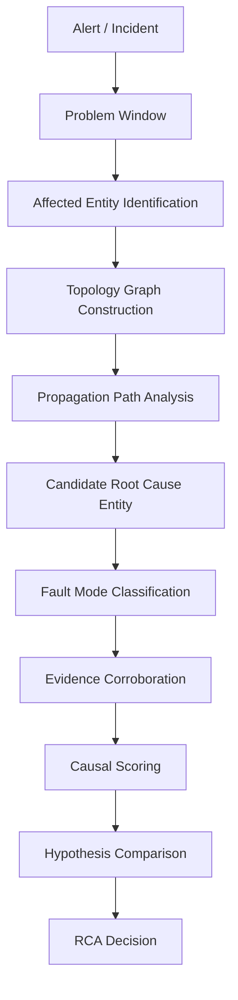

# RCA Causal Model

**版本：** V.2-RCA-1A.2 Design Doc  
**状态：** 设计文档，非实现完成报告  
**最后更新：** 2026-05-09

## 摘要

SRE Production Agent 的 RCA 模型不是简单的 pattern matching，而是以 **Problem Window** 为时间边界，以 **Topology Graph** 为上下文，以 **Propagation Path** 识别影响传播，以 **Candidate Root Cause Entity** 为推理对象，再结合 metrics / logs / traces / events 做 **Fault Mode Classification** 和 **Causal Scoring**。

当前系统已完成从 pattern-first 到 topology-first 的第一步重构（Provider Alias 分离、证据类型归一化、Score Breakdown 可观测），但 Problem Window、Topology Graph、Propagation Path 等核心因果维度仍在设计阶段，尚未在代码中落地。

---

## 为什么 Pattern-first 不够

### 旧模型

```
Evidence → Pattern Match → Coverage Score → Comparator → Decision
```

### 主要问题

1. **先枚举故障类型，而不是先识别影响路径。** Pattern 是第一入口，系统从"可能存在哪些故障"出发，而非"哪些实体受到了影响，异常如何传播"。
2. **无法区分 root cause entity 和 impacted entity。** order-service 的 5xx 可能源于自身，也可能源于 payment-service 超时——旧模型无法表达这种关系。
3. **supporting evidence type 过多时会稀释关键证据。** 证据类型归一化前，分母随 provider alias 膨胀，真实信号被噪声淹没。
4. **provider alias 容易污染 scoring denominator。** `metric_*`、`log_*`、`trace_*` 三类 alias 映射到同一 core type 时被重复计数，这是 R1-R4 回归 bug 的根因。
5. **不容易表达"异常如何传播"。** 只能判断"有异常"，不能判断"异常的起点在哪里，如何影响下游/上游"。
6. **容易把 direct-only anomaly 误判为 root cause。** 一个服务自身有异常不代表它是根因——它可能是被上游影响。
7. **对 competing hypotheses 的解释不足。** 两个 hypothesis 分数接近时，旧模型只能说"分数接近"，无法解释是因为不同故障路径竞争、不同证据来源冲突，还是模型本身信息不足。

### Pattern 仍然是需要的

Pattern 不应被否定，而应**下沉到 fault mode evidence contract**。Pattern 描述的是"某种故障类型应该有哪些证据特征"，而不是"先猜故障类型再找证据"。

结论：

> Pattern 仍然需要，但位置要下沉到 fault mode evidence contract。  
> RCA 入口从 Pattern 上移到 Problem Window + Affected Entity + Topology。

---

## 新模型总览

### Pipeline

```
Alert / Incident
  → Problem Window
  → Affected Entity Identification
  → Topology Graph Construction
  → Propagation Path Analysis
  → Candidate Root Cause Entity Generation
  → Fault Mode Classification
  → Evidence Corroboration
  → Causal Scoring
  → Hypothesis Comparison
  → RCA Decision
```



### Pipeline 阶段说明

| 阶段 | 输入 | 输出 | 当前状态 |
|------|------|------|----------|
| Problem Window | Alert startsAt, lookback config | 时间边界 [problemStart, problemEnd] | **设计阶段** — 当前使用固定 lookback |
| Affected Entity | Alert labels, service name | 受影响实体列表 | **部分实现** — 从 alert 提取 service |
| Topology Graph | Trace data, K8s labels, config | 实体间依赖图 | **设计阶段** — demo-services 有硬编码拓扑 |
| Propagation Path | Topology + affected entity | 传播路径（从候选根因到受影响实体） | **设计阶段** |
| Candidate Root Cause | Propagation path leaf nodes | 候选根因实体列表 | **设计阶段** — 当前直接生成 Pattern |
| Fault Mode Classification | Evidence + candidate entity | Fault mode 标签 | **部分实现** — DiagnosticPattern 包含 fault mode 语义 |
| Evidence Corroboration | Multi-source evidence | 跨源佐证评分 | **部分实现** — corroboratingEvidenceTypes 已支持 |
| Causal Scoring | 所有维度 | 0-1 评分 | **部分实现** — ConfidenceScorer v2 已支持多维度加权 |
| Hypothesis Comparison | 所有候选评分 | 领先假设 + 竞争假设 | **已实现** — HypothesisComparator |
| RCA Decision | Comparison + rules | 最终决策类型 | **已实现** — InvestigationDecision |

---

## 核心概念定义

### Problem Window

Problem Window 是 RCA 的**时间边界**。由 alert `startsAt`、`lookbackWindow`、`lookaheadWindow` 或 incident window 共同确定。

**核心字段：**

```
problemStart    — 异常最早观测时间
problemEnd      — 异常结束或当前时间
lookbackWindow  — 向前追溯窗口（如 30min）
lookaheadWindow — 向前观测窗口（如 5min）
```

**作用：**

1. 判断 anomaly 是否相关（timestamp ∈ [problemStart - lookback, problemEnd + lookahead]）
2. 判断 candidate anomaly 是否早于 impacted anomaly（时序因果）
3. 判断 deploy/change event 是否在合理窗口内
4. 防止把无关时间段的 evidence 误纳入 RCA

**当前状态：** 系统使用固定 lookback（通常 30min），尚未实现可配置的动态 Problem Window。时间对齐评分（temporalAlignmentScore）尚未纳入评分公式。

---

### Entity

RCA 的推理对象是**实体**，而非证据类型。

**实体类型：**

```
service         — 微服务（order-service, payment-service）
endpoint        — API 端点（/checkout, /pay）
workload        — Kubernetes workload（Deployment, StatefulSet）
pod             — Kubernetes Pod
node            — Kubernetes Node
deployment      — Deployment 版本/变更
external dependency — 外部依赖（payment gateway, Redis）
```

**实体角色区分：**

```
affectedEntity            — 直接受影响的实体（alert 报告的对象）
candidateRootCauseEntity  — 可能为根因的实体（推理目标）
impactedEntity            — 被传播影响的实体（非根因，但是受害者）
supportingEntity          — 提供佐证证据的实体（如中间件、基础设施）
```

**当前状态：** `Evidence` 记录有 `service` 字段表示来源实体，但缺少 Entity 作为一级领域对象。`affectedEntity` 从 alert 中提取，`candidateRootCauseEntity` 尚未独立建模。

---

### Topology Graph

Topology Graph 描述实体间的**依赖关系**。RCA 使用拓扑图来判断异常是否沿依赖方向传播。

**来源（按优先级）：**

```
1. trace parent-child edge         — 最高优先级（实际调用链路）
2. observed service dependency     — Prometheus metric / 日志中的调用关系
3. configured demo topology        — 实验室环境预配置
4. static fallback topology        — 文档/CMDB 中的静态关系
5. Kubernetes owner reference      — Pod → Deployment → Namespace
```

**优先级：** `trace edge > observed dependency > configured topology > static fallback`

**边的属性：**

```
edgeType        — CALLS, DEPENDS_ON, HOSTED_BY
edgeSource      — trace, observed, configured, static
edgeConfidence  — high, medium, low
```

**当前状态：** demo-services 中存在硬编码拓扑（order-service → payment-service, order-service → inventory-service），但尚无独立的 Topology Graph 数据结构或构建器。trace provider 可产出 span parent-child 关系，但未被结构化消费为拓扑图。

---

### Propagation Path

Propagation Path 描述异常如何沿依赖方向**影响其他实体**。

**示例：**

```
order-service → payment-service
```

解读：order-service 调用 payment-service；payment-service 变慢会向上游传播为 order-service 的 checkout latency / timeout。

**传播类型：**

```
downstream latency    → upstream latency / timeout
downstream error      → upstream error / retry
resource pressure     → service latency / error
deployment change     → service error / latency
crash loop            → service availability drop
```

**方向性：** 异常传播方向与调用方向相反。被调用方异常 → 调用方受影响。这是 RCA 推理的核心规则。

**当前状态：** 传播模型未在代码中实现。VerificationEngine 中的 contradiction rules（如 `downstream_latency_spike` 与 `error_rate_spike` 的关系）隐式编码了部分传播逻辑，但缺少显式的 Propagation Path 抽象。

---

### Candidate Root Cause Entity

RCA 首先应该生成 **candidate entity**，而不是直接生成 pattern。

**示例：**

```
payment-service
payment-service pod payment-7f8c9-abcde
order-service deployment v2.3.1
external payment gateway
```

每个 candidate entity 后续才会被分配 fault mode 和证据。

**当前状态：** 系统跳过这一步，直接从 pattern 生成 hypothesis。Hypothesis 中虽然隐含了候选实体（通过 evidence 的 service 字段），但未显式建模。

---

### Fault Mode

Fault Mode 描述故障的**语义类型**。每个 fault mode 对应一组 evidence contract（见 4.8 节）。

**支持的 Fault Mode：**

```
LATENCY_DEGRADATION     — 延迟升高
ERROR_SPIKE             — 错误率突增
TIMEOUT                 — 超时
RESOURCE_PRESSURE       — 资源压力（CPU/内存）
CRASH_LOOP              — Pod 崩溃循环
DEPLOYMENT_REGRESSION   — 部署引入的回归
CONFIGURATION_ERROR     — 配置错误
NETWORK_ERROR           — 网络错误
UNKNOWN                 — 未知故障类型
```

**当前状态：** DiagnosticPattern 的 id 携带 fault mode 语义（如 `deployment_regression`、`pod_crash_loop`），但无独立的 FaultMode 枚举或分类器。

---

### Evidence

Evidence 不是单纯字符串，而是结构化记录。

**核心字段（当前实现）：**

```
id            — 唯一标识
incidentId    — 所属 incident
source        — 数据来源（prometheus, loki, kubernetes, alertmanager, trace）
evidenceType  — 证据类型（如 error_rate_spike_after_deploy）
service       — 来源实体
timestamp     — 采集时间
content       — 可读描述
attributes    — 结构化属性
strength      — 信号强度 0.0-1.0
```

**证据分类：**

```
core evidence type     — 主干证据类型（如 error_rate_spike_after_deploy）
provider alias         — 提供商标识前缀（metric_*, log_*, trace_*），归一化到 core type
metadata               — attributes 中的键值对
no_signal              — 查询无结果（如 metric_no_signal）
counter evidence       — 反驳当前假设的证据
corroborating evidence — 佐证证据（存在加分，不存在不扣分）
```

**关键设计原则：**

> provider alias 不应直接污染 scoring denominator；  
> 应先归一化到 core evidence type。

**当前状态：** 已完成 alias → core 归一化（`ConfidenceScorer.ALIAS_TO_CORE`），佐证证据（corroboratingEvidenceTypes）已支持。

---

## 时间模型：Temporal Alignment

故障发生时间决定 RCA 推理的因果方向。

### 关键时间戳

```
candidate anomaly firstSeen   — 候选根因实体的异常最早观测时间
impacted anomaly firstSeen    — 受影响实体的异常最早观测时间
change event timestamp        — 部署/配置变更时间
alert startsAt                — 告警触发时间
evidence timestamp            — 证据采集时间
```

### 时序规则

```
candidate anomaly BEFORE impacted anomaly  → 加分（支持因果关系）
candidate anomaly AFTER impacted anomaly   → 降分或排除（违反因果）
candidate 与 impacted 同时                → 中性或小幅加分
evidence outside problem window            → 不计或降权
deploy event BEFORE anomaly               → deployment_regression 佐证加分
deploy event AFTER anomaly                → 排除 deployment_regression
```

### 输出维度

```
temporalAlignmentScore  — 0.0-1.0，归一化到评分公式
```

**当前状态：** 时序逻辑未在代码中显式实现。`deploy_event_near_alert_window` 作为佐证证据类型存在，隐式承载了部分时序语义。

---

## 拓扑模型：Topology Causality

Topology 回答："候选根因实体是否在受影响实体的依赖路径上？"

### 维度

```
edgeType        — 边类型（CALLS, DEPENDS_ON, HOSTED_BY）
edgeSource      — 边来源（trace, observed, configured, static）
edgeConfidence  — 边置信度
pathLength      — 路径长度（跳数）
pathConfidence  — 整条路径的置信度
direction       — 传播方向（UPSTREAM, DOWNSTREAM, SELF）
```

### edgeSource 权重

```
trace observed edge:         high confidence（实际调用链）
observed dependency:         medium-high（metrics/logs 中观测到的依赖）
configured topology:         medium（实验室预配置）
static fallback topology:    low（文档/CMDB 静态信息）
```

### 例外

```
CrashLoop 是 local fault，可以没有 upstream/downstream path。
此时 topologyCausalityScore 可以为 0 或使用 pod→node→cluster 的 host 拓扑。
```

**当前状态：** 拓扑模型未实现。无 Topology Graph、无路径计算、无 edge confidence。

---

## 传播模型：Impact Propagation

仅有 candidate 自身异常不一定足够。需要判断它是否**影响了** alert 对应的 affected entity。

### 传播类型

```
downstream latency     → upstream latency / timeout
downstream error       → upstream error / retry
resource pressure      → service latency / error
deployment change      → service error / latency
crash loop             → service availability drop
```

### 传播强度

```
propagationScore = f(
    candidate anomaly severity,
    topology path confidence,
    affected entity anomaly severity,
    temporal order (candidate before affected)
)
```

### 关键判断

> 仅有 candidate 自身异常不一定足够；  
> 要看它是否影响了 alert / incident 对应的 affected entity。

**当前状态：** 传播模型未实现。VerificationEngine 的 contradiction rules 隐式编码了传播语义。

---

## Fault Mode Evidence Contract

Pattern 不再是第一入口，而是 **fault mode evidence contract**。

每个 fault mode contract 定义：

```
directSignals              — 直接信号（该故障类型必然特征）
propagationSignals         — 传播信号（对上游/下游的影响）
supportingSources          — 支持性证据来源（metric, log, trace, k8s, alert）
counterSignals             — 反证信号（当这些信号更强时排除此 fault mode）
nonBlockingMissingSignals  — 非阻塞缺失信号（常见缺失但不否决）
explanationTemplate        — 解释模板
```

### LATENCY_DEGRADATION

```
directSignals:
  p95 latency high
  p99 latency high
  trace downstream span slow
  slow request logs

propagationSignals:
  upstream latency high
  parent span slow
  client timeout

counterSignals:
  crash loop dominates
  deployment regression dominates
  resource pressure dominates
```

### ERROR_SPIKE

```
directSignals:
  5xx rate high
  exception logs
  failed request count high

propagationSignals:
  upstream failed calls
  retry storm
  error alert
```

### TIMEOUT

```
directSignals:
  timeout logs
  trace span timeout
  client timeout

propagationSignals:
  upstream request timeout
  gateway timeout
```

### RESOURCE_PRESSURE

```
directSignals:
  CPU high
  memory high
  throttling
  saturation

propagationSignals:
  latency increase
  error increase
```

### CRASH_LOOP

```
directSignals:
  restart count
  CrashLoopBackOff
  container terminated
  OOMKilled

topology:
  service-to-service path optional
```

### DEPLOYMENT_REGRESSION

```
directSignals:
  deploy event before anomaly
  post-deploy error / latency increase

counterSignals:
  stronger infra/runtime cause
```

---

## Causal Scoring

### 统一评分公式（设计目标）

```
finalScore =
    temporalAlignmentScore
  + topologyCausalityScore
  + entityAnomalyScore
  + propagationScore
  + faultModeEvidenceScore
  + multiSourceCorroborationScore
  - counterEvidencePenalty
  - ambiguityPenalty
```

### 各维度解释

```
temporalAlignmentScore (0-0.15):
  证据是否在 Problem Window 内，以及异常先后顺序是否支持因果关系

topologyCausalityScore (0-0.20):
  candidate 是否位于 affected entity 的依赖路径上

entityAnomalyScore (0-0.20):
  candidate entity 自身是否存在异常（severity + coverage）

propagationScore (0-0.15):
  异常是否沿 topology 传播到 affected entity

faultModeEvidenceScore (0-0.20):
  证据是否符合 fault mode contract（当前 ConfidenceScorer 的 supporting coverage 维度）

multiSourceCorroborationScore (0-0.10):
  metric / log / trace / alert / k8s 是否交叉支持（来源多样性）

counterEvidencePenalty (0-0.30):
  是否存在更强反证

ambiguityPenalty (0-0.10):
  多个候选接近时降低唯一根因置信度
```

### 关键原则

> 不按 evidence 数量刷分；  
> 按语义维度和来源多样性评分。

### 当前实现

当前 `ConfidenceScorer` 的公式实际覆盖了设计目标中的部分维度：

```java
rawScore = baseScore
    + weightedSupportingCoverage × 0.60     // 对应 faultModeEvidenceScore
    + weightedCorroboratingCoverage × 0.10  // 对应 multiSourceCorroborationScore（部分）
    - weightedCounterCoverage × 0.30        // 对应 counterEvidencePenalty
    - missingPenalty                        // 对应 entityAnomalyScore（反向）
    - contradictionPenalty                  // 对应 propagationScore（隐式）
```

**缺失维度：** `temporalAlignmentScore`、`topologyCausalityScore`、`entityAnomalyScore`（正向）、`propagationScore`（显式）、`ambiguityPenalty`。

---

## Decision Rules

### 决策规则（设计目标）

```
if no topology path AND no strong local fault:
    → INSUFFICIENT_EVIDENCE

if topScore >= 0.75 AND gap >= 0.10 AND hasTopology AND hasPropagation:
    → LIKELY_ROOT_CAUSE

if topScore >= 0.60 AND hasFaultModeEvidence AND (hasTopology OR isLocalFault):
    → PROBABLE_ROOT_CAUSE

if topScore >= 0.45 AND gap < 0.10:
    → COMPETING_HYPOTHESES

if topScore >= 0.45:
    → UNCERTAIN / NEEDS_MORE_EVIDENCE

else:
    → INSUFFICIENT_EVIDENCE
```

### 当前实现（HypothesisComparator）

| Decision | 条件 |
|----------|------|
| `likely_root_cause` | top1 ≥ 0.80 且 gap ≥ 0.15 |
| `probable_root_cause` | top1 ≥ 0.60 且 gap ≥ 0.10 |
| `competing_hypotheses` | top1 ≥ 0.40 且 top2 ≥ 0.40 且 gap < 0.10 |
| `uncertain_requires_more` | top1 ≥ 0.40 |
| `insufficient_evidence` | top1 < 0.40 |

**差异分析：** 当前规则仅依赖分数阈值，未纳入 topology/propagation/isLocalFault 条件。设计目标中的 0.75→0.60→0.45 三级阈值比当前的 0.80→0.60→0.40 更细化，且多了 `hasTopology`/`hasPropagation` 作为必要条件。

### 关键设计原则

```
topology 是依赖传播类故障的重要条件；
local fault 可以不依赖 service-to-service topology。
```

---

## 各故障类型如何套用模型

| Fault Mode | Candidate Entity | Topology Required? | Key Direct Evidence | Key Propagation Evidence | Typical Counter Evidence |
|-----------|-----------------|-------------------|--------------------|------------------------|--------------------------|
| latency | downstream service | **Yes** | p95/p99 high, span slow | upstream timeout | resource pressure, deploy regression |
| error | downstream service | **Yes** | 5xx rate high, exception logs | upstream retry storm | crash loop, conf error |
| timeout | downstream/external dependency | **Yes** | timeout logs, span timeout | gateway timeout | network error |
| resource_pressure | pod/node | **No** (local) | CPU/memory high, throttling | latency/error increase | deployment regression |
| crash_loop | pod | **No** (local) | CrashLoopBackOff, OOMKilled | availability drop | deployment regression, conf error |
| deployment_regression | deployment | **No** (change event) | deploy event, post-deploy error | latency/error increase | stronger runtime cause |
| configuration_error | deployment/config | **No** (change event) | config change, error after change | service misbehavior | runtime resource issue |
| network_error | node/network | **No** (infra) | connection refused, DNS failure | service unreachable | application-level error |

---

## Score Breakdown 示例

### 示例 1：payment-service latency（理想场景）

```
affectedEntity: order-service
candidateRootCauseEntity: payment-service
propagationPath: order-service → payment-service
faultMode: LATENCY_DEGRADATION

scoreBreakdown:
  temporalAlignmentScore:          +0.08
  topologyCausalityScore:          +0.20
  entityAnomalyScore:              +0.20
  propagationScore:                +0.15
  faultModeEvidenceScore:          +0.18
  multiSourceCorroborationScore:   +0.10
  counterEvidencePenalty:           0.00
  ambiguityPenalty:                -0.03
finalScore: 0.88
decision: LIKELY_ROOT_CAUSE
```

### 示例 2：deployment regression vs downstream latency 竞争

```
deployment_regression: 0.64
downstream_latency:    0.58
gap: 0.06
decision: COMPETING_HYPOTHESES
```

说明：

> 系统不应强行唯一根因；  
> 当 deploy event 与 downstream latency 同时存在且分数接近时，应保留竞争假设。

### 示例 3：当前系统实际产出（Scenario E，2026-05-09 生产验证）

```
affectedEntity: order-service (from alert)
hypotheses:
  deployment_regression:          0.54
  downstream_dependency_latency:  0.61

leading: downstream_dependency_latency (0.61)
gap: 0.07
decision: competing_hypotheses
```

当前系统在无 topology/propagation/temporal 维度的情况下，通过 evidence type coverage 模型仍能给出合理的竞争假设判决。加入因果维度后，`downstream_dependency_latency` 的拓扑传播路径将显著提升其分数，而非仅靠 evidence coverage 微弱领先。

---

## LLM 的位置

### Online Decision Loop（在线决策环）

```
Evidence
  → Topology-first RCA Engine
  → Deterministic Causal Scoring
  → Decision
```

LLM **不参与**在线决策：

```
score          — 确定性计算公式，不依赖 LLM
decision       — 规则引擎判定，不依赖 LLM
pattern mutation — 不自动修改，需 human review
```

### Offline Learning Loop（离线学习环）

```
RCA Run
  → CausalGapReport          — 识别因果维度缺失
  → Diagnostic Knowledge Candidate — LLM 生成 candidate
  → Regression Case           — 转化为回归测试
  → Human Review              — 人工审核
  → Versioned Registry        — 版本化入库
```

LLM **可以做**（离线）：

```
critic                      — 分析 RCA 质量
gap analysis                — 识别因果模型缺失
candidate generator         — 生成新的 fault mode / evidence contract 候选
regression test suggestion  — 建议新增回归场景
```

LLM **不可以做**（在线+离线）：

```
直接裁判 root cause
直接改 score
直接发布 pattern
```

### 当前架构中的 LLM

当前 `sre-agent-llm` 模块已实现 **advisory-only** 的 LLM 集成：

- `LlmReportSynthesizer` — 生成叙述性总结（不改 decision/scores）
- `LlmHypothesisProposer` — 在 inconclusive 时建议新假设（状态 UNVERIFIED_PROPOSAL）
- `MockLlmClient` / `OpenAiCompatibleLlmClient` — 可插拔的 LLM 客户端
- 所有 LLM 输出标记 `advisoryOnly=true`，`canAffectDecision=false`

这与设计文档中 LLM 的定位一致：**offline critic / knowledge evolution，不是 online decision owner**。

---

## 分阶段实现路线

```
V.2-RCA-1A.2 ✅:  Causal Model Design Doc（本文档）

V.2-RCA-1A.3:     Problem Window & Temporal Alignment
                  - ProblemWindow 数据结构
                  - temporalAlignmentScore 实现
                  - 集成到 ConfidenceScorer 评分公式

V.2-RCA-1A.4:     Propagation Path Quality / Edge Confidence
                  - Topology Graph 数据结构
                  - edgeSource 优先级系统
                  - topologyCausalityScore 实现

V.2-RCA-1A.5:     Fault Mode Evidence Contract
                  - FaultMode 枚举 + FaultModeClassifier
                  - FaultModeEvidenceContract 结构化定义
                  - directSignals / propagationSignals / counterSignals 分类

V.2-RCA-1A.6:     Regression Scenario Matrix
                  - 覆盖所有 fault mode × topology/noTopology 组合
                  - 覆盖 competing hypotheses 场景
                  - 覆盖 insufficient evidence 边界

V.2-RCA-1B:       LLM RCA Critic / CausalGapReport
                  - LLM 分析 RCA 质量
                  - 自动识别因果维度缺失
                  - 生成 CausalGapReport

V.2-RCA-1C:       Diagnostic Knowledge Candidate Generator
                  - LLM 从 gap 中生成新 fault mode candidate
                  - 建议新 evidence contract
                  - 人工审核 pipeline
```

---

## 当前实现差距

### Already Implemented ✅

| 能力 | 位置 |
|------|------|
| Evidence type 归一化（alias → core） | `ConfidenceScorer.ALIAS_TO_CORE` |
| 比率型覆盖评分（ratio-based v2） | `ConfidenceScorer.score()` |
| 佐证证据类型（加分不扣分） | `DiagnosticPattern.corroboratingEvidenceTypes` |
| 确定性决策规则 | `HypothesisComparator` |
| 10 步工作流 pipeline | `InvestigationWorkflow` |
| Event trace 审计日志 | `EventTraceStore` |
| Markdown report 生成 | `MarkdownReporter` |
| LLM advisory-only 集成 | `sre-agent-llm` 模块 |
| 多 provider 证据采集 | k8s/prometheus/loki/alertmanager/trace providers |
| Agent 能力上下文注入 | `HermesAgentCapabilitiesProvider` |
| 完整回归测试矩阵 | ScenarioE/F + 边界测试 + 全量 132/132 |
| Score Breakdown Markdown 格式化 | `LlmGradeFormatter` |

### Partially Implemented 🔧

| 能力 | 现状 |
|------|------|
| Fault mode classification | DiagnosticPattern 隐式承载 fault mode 语义，但无独立 FaultMode 枚举/分类器 |
| Entity 建模 | Evidence.service 字段存在，但无 affectedEntity/candidateEntity 一级抽象 |
| Topology context | EvidenceCausalRole.TOPOLOGY_CONTEXT 已定义，demo-services 有硬编码拓扑，但无结构化 Topology Graph |
| Causal scoring dimensions | ConfidenceScorer v2 覆盖 faultModeEvidence + counterPenalty + corroborating，缺少 temporal/topology/propagation |
| Score Breakdown 前端展示 | ScoreBreakdown 数据结构已产出，前端 RCA 详情页已展示 |

### Missing ❌

| 能力 | 说明 |
|------|------|
| Problem Window 数据结构 | 当前使用固定 lookback，无可配置时间边界 |
| temporalAlignmentScore | 时序评分未实现 |
| Topology Graph 构建器 | 无 TopologyBuilder 类 |
| Propagation Path 计算 | 无传播路径抽象 |
| topologyCausalityScore | 拓扑评分未实现 |
| propagationScore | 传播评分未实现（仅在 contradiction rules 中隐式存在） |
| entityAnomalyScore（正向） | 当前仅通过 missingPenalty 反向表达 |
| ambiguityPenalty | 竞争假设仅通过 gap 比较，无显式惩罚 |
| CausalGapReport | 无离线分析 |
| FaultModeEvidenceContract 结构化 | 当前在 DiagnosticPattern 中扁平化表达 |

### Risk ⚠️

| 风险 | 缓解 |
|------|------|
| 过度设计 | 本阶段不写代码，仅固化设计文档；后续每个阶段控制 scope（≤ 3 个类） |
| topology 数据不足 | 优先使用 trace provider 已有数据；无拓扑场景下降级为 pattern-only scoring（已支持） |
| 历史测试大面积失效 | 新维度逐步加入评分公式，每次只引入一个维度，全量测试通过后再引入下一个 |
| LLM 越界 | 当前架构已通过 advisoryOnly + canAffectDecision=false 强制隔离 |

### Next Step

建议进入 **V.2-RCA-1A.3：Problem Window & Temporal Alignment**。

理由：
1. Problem Window 是后续所有维度的基础（topology 中的边需要时间戳、propagation 需要时序关系）
2. 实现量可控（~3 个类：ProblemWindow 值对象、TemporalAligner 评分器、集成到 ConfidenceScorer）
3. 不依赖其他未实现维度，可以独立落地并跑通全量测试

---

## 文档风格说明

本文档面向三类读者：
1. **面试官** — 展示系统设计深度、trade-off 思考、分阶段落地能力
2. **平台工程 / SRE 负责人** — 提供可评审的架构决策依据
3. **后续 Hermes 实现任务** — 提供清晰的实现方向和优先级

本文档遵循以下原则：
- 中文为主，架构表达清楚
- 不堆砌 AI 术语，不营销
- 工程可落地，不一味追求大而全
- 明确解释为什么 topology-first 比 pattern-first 更合理
- 明确标注当前是设计目标还是已有实现
- 不声称等同 Dynatrace 或任何商业 AIOps 平台

---

## 参考

本系统参考行业 RCA 系统中的 topology-aware RCA 思路，但采用轻量级 MVP 设计，不依赖完整图数据库、不实现完整商业 AIOps 平台。

参考原则：
1. RCA 不应只依赖时间相关性
2. RCA 应结合 topology / dependency / transaction / service context
3. Problem 应聚合多个相关事件，而不是只处理单个 alert
4. Root cause candidate 应结合 affected topology 和 anomaly evidence ranking
5. Metrics / logs / traces / events 应被统一到可解释的 evidence model
6. 多源证据不是简单数量累加，而是 corroboration
7. 事件发生时间和传播顺序影响 RCA 置信度
