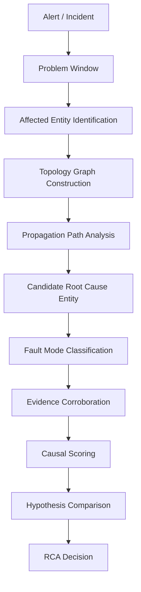

# Hermes Prompt: V.2-RCA-1A.2
## RCA Causal Model Design Doc
### 基于时间窗口、拓扑关系、传播路径与多源证据的 RCA 设计说明

## 0. 当前背景

当前项目已经完成或部分完成：

```text
1. Pattern-first → Topology-first RCA engine 重构
2. Provider alias 分离与 scoring 修复
3. ScenarioE/F 回归修复
4. Topology causal scoring 集成测试
5. Score Breakdown 可观测
```

但当前系统仍缺少一份清晰的 RCA 设计文档，用于解释：

```text
1. 为什么 RCA 不应只基于 Pattern / Evidence Type Coverage
2. 为什么应从 Problem Window、Topology、Propagation Path 出发
3. Pattern 在新模型中处于什么位置
4. 时间、拓扑、传播、多源证据如何共同影响 score
5. LLM 在 RCA 系统中应该参与哪一层，不应该参与哪一层
6. 后续如何继续精进，而不是继续打补丁
```

本阶段不要继续大改代码。  
优先生成设计文档，固化 RCA causal model。

---

# 1. 本阶段目标

生成架构设计文档：

```text
docs/architecture/rca-causal-model.md
```

文档目标：

```text
1. 解释当前 RCA 引擎为什么从 pattern-first 升级到 topology-first
2. 给出本系统的 RCA causal model
3. 定义核心概念：Problem Window / Entity / Topology / Propagation / Candidate / Fault Mode / Score / Decision
4. 说明故障发生时间、传播路径、拓扑关系、metrics/logs/traces/events 如何参与 RCA
5. 说明 Pattern 的新定位：fault mode evidence contract，而不是第一入口
6. 说明 LLM 的位置：offline critic / knowledge evolution，不是 online decision owner
7. 给出后续分阶段实现路线
```

---

# 2. 参考原则

可以参考 Dynatrace / AIOps RCA 的公开设计理念，但不要照搬，也不要声称完全复刻。

需要吸收的原则：

```text
1. RCA 不应只依赖时间相关性
2. RCA 应结合 topology / dependency / transaction / service context
3. Problem 应聚合多个相关事件，而不是只处理单个 alert
4. Root cause candidate 应结合 affected topology 和 anomaly evidence ranking
5. Metrics / logs / traces / events 应被统一到可解释的 evidence model
6. 多源证据不是简单数量累加，而是 corroboration
7. 事件发生时间和传播顺序影响 RCA 置信度
```

在文档中表述为：

```text
本系统参考行业 RCA 系统中的 topology-aware RCA 思路，
但采用轻量级 MVP 设计，不依赖完整图数据库、不实现完整商业 AIOps 平台。
```

---

# 3. 必读当前项目资料

在生成文档前，请先阅读当前项目中已有相关文件。

优先搜索并阅读：

```text
docs/architecture/
docs/reports/
README.md
CHANGELOG.md

ConfidenceScorer.java
CausalScorer.java
HypothesisComparator.java
VerificationEngine.java
TopologyBuilder.java
FaultModeClassifier.java
InvestigationWorkflow.java
DiagnosticPattern.java
Evidence.java
EvidenceType.java
MarkdownReporter.java
```

如果文件不存在，不要阻塞。  
请基于现有实现和本文设计要求生成文档。

---

# 4. 文档结构要求

生成的 `docs/architecture/rca-causal-model.md` 必须包含以下章节。

---

## 4.1 标题与摘要

标题：

```text
# RCA Causal Model
```

摘要必须说明：

```text
SRE Production Agent 的 RCA 模型不是简单的 pattern matching，
而是以 Problem Window 为时间边界，以 Topology Graph 为上下文，
以 Propagation Path 识别影响传播，以 Candidate Root Cause Entity 为推理对象，
再结合 metrics / logs / traces / events 做 fault mode classification 和 causal scoring。
```

---

## 4.2 为什么 Pattern-first 不够

说明旧模型的问题：

```text
Evidence → Pattern Match → Coverage Score → Comparator
```

主要问题：

```text
1. 先枚举故障类型，而不是先识别影响路径
2. 无法区分 root cause entity 和 impacted entity
3. supporting evidence type 过多时会稀释关键证据
4. provider alias 容易污染 scoring denominator
5. 不容易表达“异常如何传播”
6. 容易把 direct-only anomaly 误判为 root cause
7. 对 competing hypotheses 的解释不足
```

注意：不要否定 Pattern。  
结论应是：

```text
Pattern 仍然需要，但位置要下沉到 fault mode evidence contract。
```

---

## 4.3 新模型总览

给出新 pipeline：

```text
Alert / Incident
  → Problem Window
  → Affected Entity Identification
  → Topology Graph Construction
  → Propagation Path Analysis
  → Candidate Root Cause Entity Generation
  → Fault Mode Classification
  → Evidence Corroboration
  → Causal Scoring
  → Hypothesis Comparison
  → RCA Decision
```

必须包含 Mermaid 图：



---

## 4.4 核心概念定义

必须定义以下概念：

### Problem Window

说明：

```text
Problem Window 是 RCA 的时间边界。
它由 alert startsAt、lookback window、lookahead window 或 incident window 共同确定。
```

包括：

```text
problemStart
problemEnd
lookbackWindow
lookaheadWindow
```

解释它的作用：

```text
1. 判断 anomaly 是否相关
2. 判断 candidate anomaly 是否早于 impacted anomaly
3. 判断 deploy/change event 是否在合理窗口内
4. 防止把无关时间段的 evidence 误纳入 RCA
```

---

### Entity

定义：

```text
service
endpoint
workload
pod
node
deployment
external dependency
```

区分：

```text
affectedEntity
candidateRootCauseEntity
impactedEntity
supportingEntity
```

---

### Topology Graph

说明来源：

```text
1. trace parent-child edge
2. observed service dependency evidence
3. configured demo topology
4. static fallback topology
5. Kubernetes owner reference
```

优先级：

```text
trace edge > observed dependency > configured topology > static fallback
```

---

### Propagation Path

说明：

```text
Propagation Path 描述异常如何沿依赖方向影响其他实体。
```

示例：

```text
order-service → payment-service
```

解释方向：

```text
order-service 调用 payment-service；
payment-service 变慢会向上游传播为 order-service checkout latency / timeout。
```

---

### Candidate Root Cause Entity

说明：

```text
RCA 首先应该生成 candidate entity，而不是直接生成 pattern。
```

示例：

```text
payment-service
payment-service pod
order-service deployment
external payment gateway
```

---

### Fault Mode

支持：

```text
LATENCY_DEGRADATION
ERROR_SPIKE
TIMEOUT
RESOURCE_PRESSURE
CRASH_LOOP
DEPLOYMENT_REGRESSION
CONFIGURATION_ERROR
NETWORK_ERROR
UNKNOWN
```

---

### Evidence

说明 evidence 不是单纯字符串，而应至少包含：

```text
id
source
entity
service
timestamp
type
semanticType
severity
content
metadata
```

区分：

```text
core evidence type
provider alias
metadata
no_signal
counter evidence
```

强调：

```text
provider alias 不应直接污染 scoring denominator；
应先归一化到 core evidence type。
```

---

## 4.5 时间模型：Temporal Alignment

说明故障发生时间如何影响 RCA。

必须包含：

```text
candidate anomaly firstSeen
impacted anomaly firstSeen
change event timestamp
alert startsAt
evidence timestamp
```

规则示例：

```text
candidate anomaly before impacted anomaly → 加分
candidate anomaly after impacted anomaly → 降分
candidate and impacted simultaneous → 中性或小幅加分
evidence outside problem window → 不计或降权
deploy event before anomaly → deployment_regression 加分
```

输出维度：

```text
temporalAlignmentScore
```

---

## 4.6 拓扑模型：Topology Causality

说明 topology 如何影响 score。

维度：

```text
edgeType
edgeSource
edgeConfidence
pathLength
pathConfidence
direction
```

edgeSource 权重示例：

```text
trace observed edge: high confidence
observed dependency evidence: medium-high
configured topology: medium
static fallback topology: low
```

说明：

```text
依赖传播类故障需要 topology path；
local runtime fault 不一定需要 service-to-service topology。
```

例如：

```text
CrashLoop 是 local fault，可以没有 upstream/downstream path。
```

---

## 4.7 传播模型：Impact Propagation

说明 propagationScore 如何计算。

传播类型：

```text
downstream latency → upstream latency / timeout
downstream error → upstream error / retry
resource pressure → service latency / error
deployment change → service error / latency
crash loop → service availability drop
```

强调：

```text
仅有 candidate 自身异常不一定足够；
要看它是否影响了 alert / incident 对应的 affected entity。
```

---

## 4.8 Fault Mode Evidence Contract

说明 Pattern 的新定位。

Pattern 不再是第一入口，而是：

```text
fault mode evidence contract
```

每个 fault mode contract 包含：

```text
directSignals
propagationSignals
supportingSources
counterSignals
nonBlockingMissingSignals
explanationTemplate
```

举例说明：

### LATENCY_DEGRADATION

```text
directSignals:
  p95 latency high
  p99 latency high
  trace downstream span slow
  slow request logs

propagationSignals:
  upstream latency high
  parent span slow
  client timeout

counterSignals:
  crash loop dominates
  deployment regression dominates
  resource pressure dominates
```

### ERROR_SPIKE

```text
directSignals:
  5xx rate high
  exception logs
  failed request count high

propagationSignals:
  upstream failed calls
  retry storm
  error alert
```

### TIMEOUT

```text
directSignals:
  timeout logs
  trace span timeout
  client timeout

propagationSignals:
  upstream request timeout
  gateway timeout
```

### RESOURCE_PRESSURE

```text
directSignals:
  CPU high
  memory high
  throttling
  saturation

propagationSignals:
  latency increase
  error increase
```

### CRASH_LOOP

```text
directSignals:
  restart count
  CrashLoopBackOff
  container terminated
  OOMKilled

topology:
  service-to-service path optional
```

### DEPLOYMENT_REGRESSION

```text
directSignals:
  deploy event before anomaly
  post-deploy error / latency increase

counterSignals:
  stronger infra/runtime cause
```

---

## 4.9 Causal Scoring

给出统一评分公式：

```text
finalScore =
    temporalAlignmentScore
  + topologyCausalityScore
  + entityAnomalyScore
  + propagationScore
  + faultModeEvidenceScore
  + multiSourceCorroborationScore
  - counterEvidencePenalty
  - ambiguityPenalty
```

每个维度解释：

```text
temporalAlignmentScore:
  证据是否在 Problem Window 内，以及异常先后顺序是否支持因果关系

topologyCausalityScore:
  candidate 是否位于 affected entity 的依赖路径上

entityAnomalyScore:
  candidate entity 自身是否存在异常

propagationScore:
  异常是否沿 topology 传播到 affected entity

faultModeEvidenceScore:
  证据是否符合 fault mode contract

multiSourceCorroborationScore:
  metric / log / trace / alert / k8s 是否交叉支持

counterEvidencePenalty:
  是否存在更强反证

ambiguityPenalty:
  多个候选接近时降低唯一根因置信度
```

强调：

```text
不按 evidence 数量刷分；
按语义维度和来源多样性评分。
```

---

## 4.10 Decision Rules

给出决策规则：

```text
if no topology path and no strong local fault:
    INSUFFICIENT_EVIDENCE

if topScore >= 0.75 and gap >= 0.10 and hasTopology and hasPropagation:
    LIKELY_ROOT_CAUSE

if topScore >= 0.60 and hasFaultModeEvidence and (hasTopology or isLocalFault):
    PROBABLE_ROOT_CAUSE

if topScore >= 0.45 and gap < 0.10:
    COMPETING_HYPOTHESES

if topScore >= 0.45:
    UNCERTAIN / NEEDS_MORE_EVIDENCE

else:
    INSUFFICIENT_EVIDENCE
```

说明：

```text
topology 是依赖传播类故障的重要条件；
local fault 可以不依赖 service-to-service topology。
```

---

## 4.11 各故障类型如何套用模型

用表格说明：

```text
Fault Mode
Candidate Entity
Topology Required?
Key Direct Evidence
Key Propagation Evidence
Typical Counter Evidence
```

至少覆盖：

```text
latency
error
timeout
resource_pressure
crash_loop
deployment_regression
configuration_error
network_error
```

---

## 4.12 Score Breakdown 示例

给出至少两个示例。

### 示例 1：payment-service latency

```text
affectedEntity: order-service
candidateRootCauseEntity: payment-service
propagationPath: order-service -> payment-service
faultMode: LATENCY_DEGRADATION

scoreBreakdown:
  temporalAlignmentScore: +0.08
  topologyCausalityScore: +0.20
  entityAnomalyScore: +0.20
  propagationScore: +0.15
  faultModeEvidenceScore: +0.18
  multiSourceCorroborationScore: +0.10
  counterEvidencePenalty: 0.00
  ambiguityPenalty: -0.03
finalScore: 0.88
decision: LIKELY_ROOT_CAUSE
```

### 示例 2：deployment regression vs downstream latency competing

```text
deployment_regression: 0.64
downstream_latency: 0.58
gap: 0.06
decision: COMPETING_HYPOTHESES
```

说明：

```text
系统不应强行唯一根因；
当 deploy event 与 downstream latency 同时存在且分数接近时，应保留竞争假设。
```

---

## 4.13 LLM 的位置

说明在线与离线双环。

### Online Decision Loop

```text
Evidence
  → Topology-first RCA Engine
  → Deterministic Causal Scoring
  → Decision
```

LLM 不参与：

```text
score
decision
production rule mutation
```

### Offline Learning Loop

```text
RCA Run
  → CausalGapReport
  → Diagnostic Knowledge Candidate
  → Regression Case
  → Human Review
  → Versioned Registry
```

LLM 可以做：

```text
critic
gap analysis
candidate generator
regression test suggestion
```

LLM 不可以做：

```text
直接裁判 root cause
直接改 score
直接发布 pattern
```

---

## 4.14 分阶段实现路线

给出后续路线：

```text
V.2-RCA-1A.2:
  Causal Model Design Doc

V.2-RCA-1A.3:
  Problem Window & Temporal Alignment

V.2-RCA-1A.4:
  Propagation Path Quality / Edge Confidence

V.2-RCA-1A.5:
  Fault Mode Evidence Contract

V.2-RCA-1A.6:
  Regression Scenario Matrix

V.2-RCA-1B:
  LLM RCA Critic / CausalGapReport

V.2-RCA-1C:
  Diagnostic Knowledge Candidate Generator
```

---

## 4.15 当前实现差距

结合当前代码和报告，列出：

```text
Already implemented
Partially implemented
Missing
Risk
Next step
```

必须诚实说明：

```text
1. 哪些只是设计目标
2. 哪些已有代码支持
3. 哪些需要后续实现
```

---

# 5. 文档风格要求

文档要面向：

```text
1. 面试官
2. 平台工程 / SRE 负责人
3. 后续 Hermes 实现任务
```

要求：

```text
1. 中文为主
2. 架构表达清楚
3. 不要堆砌 AI 术语
4. 不要过度营销
5. 要有工程可落地性
6. 要能解释为什么 topology-first 比 pattern-first 更合理
7. 要明确哪些地方是 MVP 简化
```

---

# 6. 禁止事项

```text
1. 不改代码
2. 不改测试
3. 不继续实现 V.2-RCA-1B / 1C
4. 不声称系统已经完全等同 Dynatrace
5. 不引入无法落地的大而全架构
6. 不把 LLM 描述成在线 RCA 裁判
7. 不否定 Pattern 的价值
8. 不把 evidence 数量当作 score 依据
```

---

# 7. 验收标准

完成后必须满足：

```text
1. 生成 docs/architecture/rca-causal-model.md
2. 文档包含 topology-first RCA pipeline
3. 文档定义 Problem Window / Entity / Topology / Propagation / Candidate / Fault Mode / Evidence
4. 文档说明 temporal alignment
5. 文档说明 topology causality
6. 文档说明 propagation scoring
7. 文档说明 fault mode evidence contract
8. 文档说明 causal scoring dimensions
9. 文档说明 decision rules
10. 文档说明 LLM online/offline 边界
11. 文档包含分阶段实现路线
12. 文档明确当前实现差距
```

---

# 8. 完成报告

执行完成后输出：

```text
1. 生成文件路径
2. 文档章节清单
3. 当前实现与设计差距摘要
4. 后续建议的 Hermes 任务顺序
5. 是否建议进入 V.2-RCA-1A.3：Problem Window & Temporal Alignment
```
